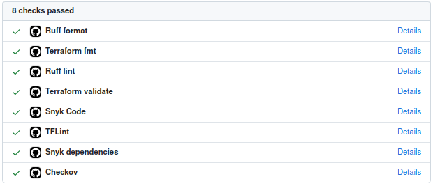
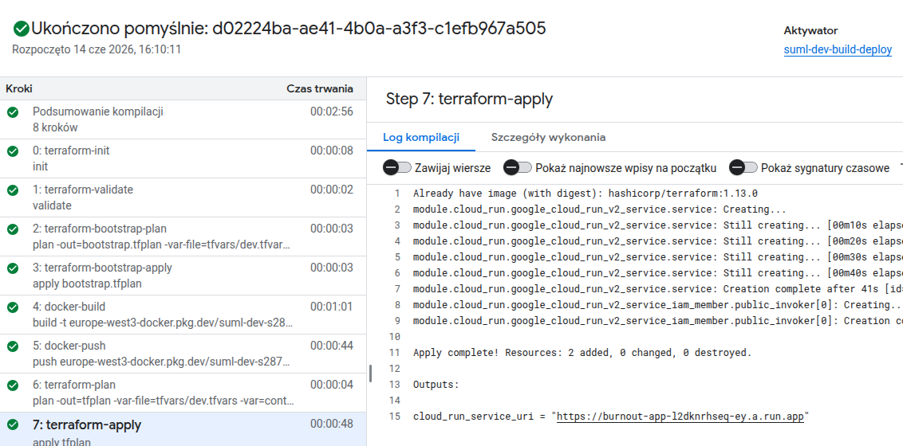

## SUML Project

Sole contributor: Urszula Kamińska, s28722

Deployed Application URL: https://burnout-app-l2dknrhseq-ey.a.run.app/


## Streamlit Application

The application is a Streamlit app that lets users enter developer profile values and receive a burnout prediction with class probabilities.


### Data

The dataset contains developer-related features such as age, experience, daily work hours, sleep, caffeine intake, bugs and commits per day, meetings, screen time, exercise, stress level and burnout level. It is used for burnout classification.

Dataset source: https://www.kaggle.com/datasets/asifxzaman/developer-burnout-prediction-dataset7000-samples/data

### Model

The trained model is a RandomForestClassifier. The recorded evaluation results are 0.9920 accuracy, 0.9919 macro F1 and 0.9920 weighted F1.


## Git hooks

This project uses Git hooks managed by pre-commit to validate code and configuration before commits and pushes.

- **Ruff**: runs Python linting and formatting checks.
- **isort**: sorts and groups Python imports.
- **mypy**: checks Python types for common errors.
- **terraform fmt**: formats Terraform files to canonical HCL style.
- **check-yaml**: validates YAML syntax.
- **detect-private-key**: detects private keys in staged files.
- **detect-secrets**: flags likely secrets and tokens.
- **Conventional Commits**: enforces a consistent commit message format.

## CI/CD

GitHub Actions is used for pull request validation. It runs separate checks for Python and Terraform, including formatting, linting, validation, TFLint, Checkov and Snyk scans. Each check is exposed as its own status in the PR view, which makes failures easier to identify.



Cloud Build is used for the deployment pipeline in Google Cloud. It is triggered after changes are merged into the main branch and handles the build and deployment flow for the application and infrastructure defined in the project.

## Cloud

The application is deployed to Google Cloud Run. Docker images are stored in Artifact Registry.

### Prerequisites

- Cloud Build, Cloud Run Admin and Artifact Registry APIs are enabled.
- A Cloud Build trigger runs `cloudbuild.yaml` with a service account that can manage Terraform state, Service Accounts Artifact Registry and Cloud Run.
- The Terraform state bucket `suml-s28722-terraform-state` exists.

## Terraform

Terraform creates:

- an Artifact Registry Docker repository,
- a Cloud Run runtime service account,
- a Cloud Run service running the image tagged with the Cloud Build commit SHA,

The Cloud Run runtime service account is intentionally created without additional IAM roles because the Streamlit application does not call Google Cloud APIs at runtime.

### Deployment

Cloud Build runs the deployment pipeline from `cloudbuild.yaml`:

1. Initializes and validates Terraform.
2. Plans and applies the Artifact Registry bootstrap so the image can be pushed.
3. Builds the Docker image of the Streamlit application.
4. Pushes the image to Artifact Registry.
5. Runs Terraform plan and apply.



## Local setup

Python 3.13 is used in the Docker image and CI workflows.

1. Clone the repository:
   ```sh
   git clone https://github.com/urszkam/suml-s28722.git
   cd projekt
   ```
2. From the project root, install development dependencies and Git hooks:
   ```sh
   python -m pip install -r requirements.txt
   pre-commit install
   pre-commit install --hook-type pre-push
   pre-commit install --hook-type commit-msg
   ```
3. Build and run the Docker image:
   ```sh
   docker build -t burnout-app app
   docker run --rm -p 8080:8080 burnout-app
   ```

To run the app without Docker, install the app dependencies and start Streamlit:

```sh
python -m pip install -r app/requirements.txt
cd app
streamlit run app.py --server.port=8080
```
